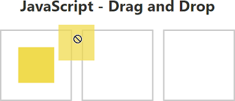

# Drag and Drop Chess

 <!-- Update the path if needed after adding the image -->

## Introduction

Welcome to the **Drag and Drop Chess** project! This project demonstrates the implementation of a chess game using drag-and-drop functionality. Players can easily move chess pieces on the board, making it a fun and interactive way to play chess online.

## Features

- **Drag and Drop**: Move chess pieces by dragging them to the desired position.

## Technologies Used

- **HTML5**: For the basic structure of the chess game.
- **css3 (Scss)**: To style the game board and pieces.
- **JavaScript**: For implementing drag-and-drop functionality and game logic.

## Getting Started Link On vercel

### Prerequisites

- A modern web browser (Chrome, Firefox, Safari, etc.)

### Installation

1. Clone the repository:
   ```bash
   git clone https://github.com/yourusername/drag-and-drop-chess.git
   ```
